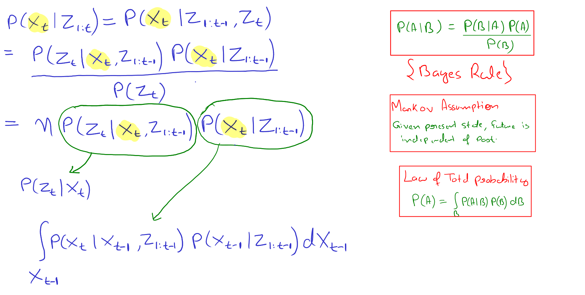
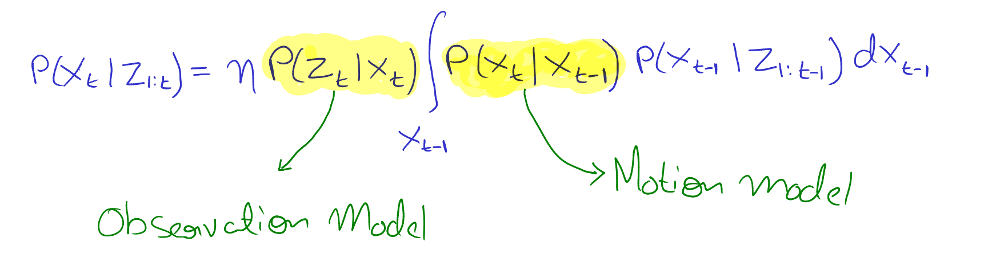
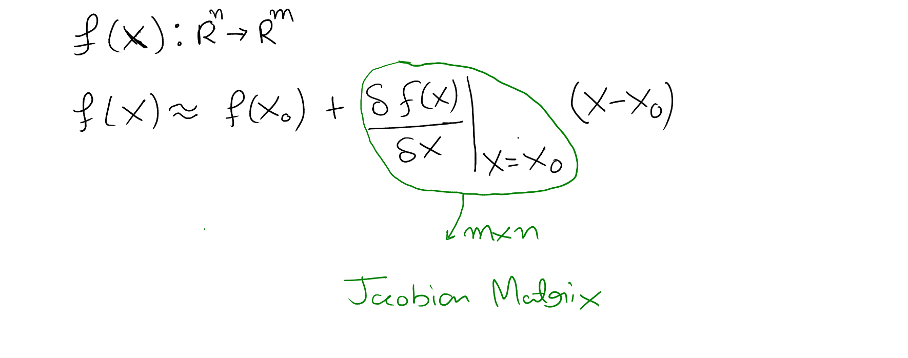

## Problem Statement
> Estimate the **state X**, given **Motion model**, **Observation model** and Observations.

**Motion Model:** $P(X_t | X_{t-1})$

**Observation Model:** $P(Z_t|X_t)$

**Problem:** $P(X_t | Z_{1:t})$ 

## Recursive Bayes Filter

Recursive bayes filter can be broken into two steps:

1. **[Prediction Step]** Given the previous estimate of state (i.e. $P(X_{t-1}|Z_{1:t-1})$) and motion model (i.e. $P(X_t|X_{t-1})$) estimate the next state. 
   $$
   \overline{bel}(X_t) = \int_{X_{t-1}}P(X_t|X_{t-1})P(X_{t-1}|Z_{1:t-1}dX_{t-1}
   $$

2. **[Correction Step]** Update the belife from prediction step (i.e. $\overline{bel}(X_t)$) with new observation (i.e. $Z_t$) and the observation model (i.e. $P(Z_t|X_t)$).
   $$
   bel(X_t) = \eta P(Z_t|X_t) \overline{bel}(X_t)
   $$

## Kalman Filter

> Kalman filter is an implementation of recursive bayes filter given the motion model and observation model is linear and noise is gaussian.

**Motion model:** $P(X_t|X_{t-1}) = N(AX_{t-1} + Bu_t, R)$

**Observation model:** $P(Z_t|X_t) = N(CX_t, Q)$

kalman_filter($\mu_{t-1}, \Sigma_{t-1}, u_t, Z_t$):

1. $\overline{\mu}_t = A\mu_{t-1} + Bu_t$ **[Prediction Step]**
2. $\overline{\Sigma}_t = A\Sigma_{t-1}A^T + R$ **[Prediction Step]**
3. $K_t = \overline{\Sigma}_t C^T (C\overline{\Sigma}_tC^T + Q)^{-1}$ **[Observation Step]**
4. $\mu_t = \overline{\mu}_t + K_t(Z_t - C\overline{\mu}_t)$ **[Observation Step]**
5. $\Sigma_t = (I - K_tC) \overline{\Sigma}_t$ **[Observation Step]**
6. return $\mu_t, \Sigma_t$

## Extended Kalman Filter

> Extended kalman filter is an extention of kalman filter where motion model and observation model are non linear, but they are linearized using first order taylor expantion and then kalman filter is applied normally.

**Motion Model:** $P(X_t|X_{t-1}) = N(g(X_{t-1}, u_t), R)$

**Observation model:** $P(Z_t|X_t) = N(h(X_t), Q)$

Linearization of a function: 

**Linearized motion model:** $P(X_t|X_{t-1}) = N(g(\mu_{t-1}, u_t) + G_t*(X_{t-1} - \mu_{t-1}), R)$

**Linearized observation model:** $P(Z_t|X_t) = N(h(\mu_{t-1}) + H_t * (X_t - \mu_{t-1}), Q)$

Where, $G_t$ and $H_t$ is the jacobian matrix of functions $g$ and $h$ respectively.

kalman_filter($\mu_{t-1}, \Sigma_{t-1}, u_t, Z_t$):

1. $\overline{\mu}_t = g(\mu_{t-1}, u_t)$ **[Prediction Step]**
2. $\overline{\Sigma}_t = G_t\Sigma_{t-1}G_t^T + R$ **[Prediction Step]**
3. $K_t = \overline{\Sigma}_t H_t^T (H_t\overline{\Sigma}_tH_t^T + Q)^{-1}$ **[Observation Step]**
4. $\mu_t = \overline{\mu}_t + K_t(Z_t - h(\overline{\mu}_t))$ **[Observation Step]**
5. $\Sigma_t = (I - K_tH_t) \overline{\Sigma}_t$ **[Observation Step]**
6. return $\mu_t, \Sigma_t$
